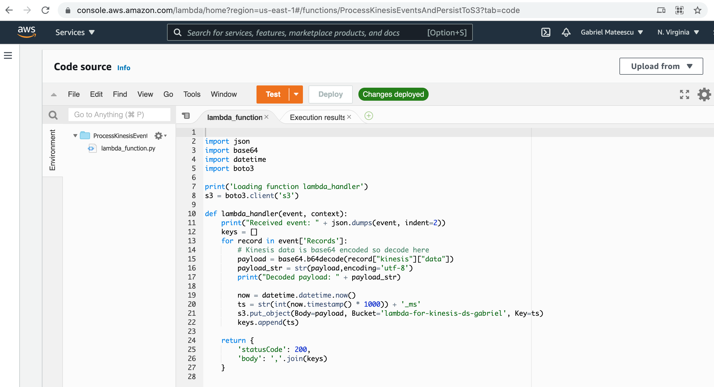

# Lambda_function_for_Kinesis_data_source

Implement a Lambda function that consumes events from Kinesis and exports them to S3.


## Table of Contents


- [Prerequisites](#prereqs)  

- [Lambda function code](#code)

- [AWS CLI Version](#version)

- [Create IAM role 'lambda-get-kinesis-events-export-to-s3'](#iam_role)
  - [Create policy document](#iam_policy)
  - [Run 'aws iam create-role --role-name lambda-get-kinesis-events-export-to-s3'](#iam_create_role)
  - [Check role lambda-get-kinesis-events-export-to-s3](#iam_check_role)
  - [Assign policies to the role lambda-get-kinesis-events-export-to-s3](#role_policies)
    - [Initial policies attached to role 'lambda-get-kinesis-events-export-to-s3'](#role_policies_ini)
    - [Attach policies to the role 'lambda-get-kinesis-events-export-to-s3'](#role_policies_attach)
    - [Check policies attached to the role 'lambda-get-kinesis-events-export-to-s3'](#check_policies)

- [Create S3 bucket and attach bucket policy](#s3_mb)
  - [Create S3 bucket 'lambda-for-kinesis-ds-gabriel'](#s3_mb_kinesis)
  - [Create S3 bucket policy and attach it to bucket 'lambda-for-kinesis-ds-gabriel'](#s3_bucket_policy)
    - [Create S3 bucket policy "s3-bucket-policy.json"](#s3_policy_create)
    - [Attach the policy to the bucket lambda-for-kinesis-ds-gabriel](#s3_policy_attach)

- [Create the Kinesis event stream 'kinesis-stream-for-lambda'](#create_kinesis_ev_stream)

- [Create the lambda function ProcessKinesisEventsAndPersistToS3](#create_lambda_func)
  - [Create deployment package](#create_deploy_pkg)
  - [Create lambda-function ProcessKinesisEventsAndPersistToS3](#create_func)

- [Add 'kinesis-stream-for-lambda' as event source to the Lambda function](#map_event_stream)
  - [The Kinesis stream "kinesis-stream-for-lambda"](#the_event_stream)
  - [Add Kinesis stream as event source to function 'ProcessKinesisRecords'](#add_event_stream)
  - [Check event source mappings for lambda function 'ProcessKinesisEventsAndPersistToS3'](#check_event_map)


<a name="prereqs" id="prereqs"></a>
## Prerequisites


The AWS client is installed on the machine, and the AWS configuration and credentials are set up under
```bash
   ~/.aws
```


<a name="code" id="code"></a>
## Lambda function code 


I have implemented the lambda function in Python. I developed the code
on the local host, and I created the lambda function with AWS CLI
(aws lambda create-function), thereby getting the oppoortunity to
develop and test the lambda function using AWS Cloud9
integrated development environment as shown below:





Let's describe the Python code in detail:

```python
  $ cat lambda_function.py

  import json
  import base64
  import datetime
  import boto3

  print('Loading function lambda_handler')
  s3 = boto3.client('s3')

  def lambda_handler(event, context):

    print("Received event: " + json.dumps(event, indent=2))
    keys = []

    for record in event['Records']:
        # Kinesis data is base64 encoded so decode here
        payload = base64.b64decode(record["kinesis"]["data"])
        payload_str = str(payload,encoding='utf-8')
        print("Decoded payload: " + payload_str)
        
        now = datetime.datetime.now()
        ts = str(int(now.timestamp() * 1000)) + '_ms'
        s3.put_object(Body=payload, Bucket='lambda-for-kinesis-ds-gabriel', Key=ts)
        keys.append(ts)
    
    return {
        'statusCode': 200,
        'body': ','.join(keys)
    }

```

The `lambda_handler` function receives receives and processes events from a Kinesis data,
which is configured as shown in section "Add 'kinesis-stream-for-lambda' as event source to 
Lambda function".


The for loop iterates over all event records in `event['Records']`, extracts the payload,
writes it to the CloudWatch logs and exports it to the S3 bucket 'lambda-for-kinesis-ds-gabriel'
(section "Create the S3 bucket 'lambda-for-kinesis-ds-gabriel' and attach bucket policy" 
describes the creation of the S3 bucket 'lambda-for-kinesis-ds-gabriel').


We use the time stamp (current time in milliseconds) as the key of the object inserted in S3,
and the payload of the event as the body of the object.


Thus, we persist the Kinesis events to S3.


<a name="version" id="version"></a>
## AWS CLI Version

The version of he AWS client we use is
```bash
   gabriel $ aws --version
   aws-cli/2.0.62 Python/3.9.0 Darwin/19.6.0 source/x86_64
```


<a name="iam_role" id="iam_role"></a>
##  Create IAM role 'lambda-get-kinesis-events-export-to-s3'


<a name="iam_policy" id="iam_policy"></a>
### Create policy document

The  policy doc is
```
  gabriel $ cd src

  gabriel $ more lambda-trust-policy.json
   {
    "Version": "2012-10-17",  
    "Statement": [
      {
        "Effect": "Allow",
        "Principal": {
          "Service": "lambda.amazonaws.com"
        },
        "Action": "sts:AssumeRole"
      }
    ]
  }
```


<a name="iam_create_role" id="iam_create_role"></a>
### Run 'aws iam create-role --role-name lambda-get-kinesis-events-export-to-s3'


Create role 'lambda-get-kinesis-events-export-to-s3'
```
  gabriel $ cd src

  gabriel $ aws iam create-role \
         --role-name lambda-get-kinesis-events-export-to-s3 \
         --assume-role-policy-document file://lambda-trust-policy.json
  {
    "Role": {
        "Path": "/",
        "RoleName": "lambda-get-kinesis-events-export-to-s3",
        "RoleId": "AROASASKFEOOGGMYWPZGG",
        "Arn": "arn:aws:iam::138668221340:role/lambda-get-kinesis-events-export-to-s3",
        "CreateDate": "2021-09-27T17:32:44+00:00",
        "AssumeRolePolicyDocument": {
            "Version": "2012-10-17",
            "Statement": [
                {
                    "Effect": "Allow",
                    "Principal": {
                        "Service": "lambda.amazonaws.com"
                    },
                    "Action": "sts:AssumeRole"
                }
            ]
        }
    }
  }
```


<a name="iam_check_role" id="iam_check_role"></a>
### Check role lambda-get-kinesis-events-export-to-s3
```
  gabriel $ aws iam get-role --role-name lambda-get-kinesis-events-export-to-s3
  {
    "Role": {
        "Path": "/",
        "RoleName": "lambda-get-kinesis-events-export-to-s3",
        "RoleId": "AROASASKFEOOGGMYWPZGG",
        "Arn": "arn:aws:iam::138668221340:role/lambda-get-kinesis-events-export-to-s3",
        "CreateDate": "2021-09-27T17:32:44+00:00",
        "AssumeRolePolicyDocument": {
            "Version": "2012-10-17",
            "Statement": [
                {
                    "Effect": "Allow",
                    "Principal": {
                        "Service": "lambda.amazonaws.com"
                    },
                    "Action": "sts:AssumeRole"
                }
            ]
        },
        "MaxSessionDuration": 3600,
        "RoleLastUsed": {}
    }
  }
```


<a name="role_policies" id="role_policies"></a>
### Assign policies to the role lambda-get-kinesis-events-export-to-s3


Will assign the polices needed to access Kinesis, CloudWatch and S3.


<a name="role_policies_ini" id="role_policies_ini"></a>
#### Initial policies attached to role 'lambda-get-kinesis-events-export-to-s3'

```bash
    gabriel $ aws iam list-attached-role-policies --role-name lambda-get-kinesis-events-export-to-s3
    {
      "AttachedPolicies": []
    }
```


<a name="role_policies_attach" id="role_policies_attach"></a>
#### Attach policies to the role 'lambda-get-kinesis-events-export-to-s3'


- AWSLambdaBasicExecutionRole
```
   gabriel $ aws iam attach-role-policy    \
                 --role-name  lambda-get-kinesis-events-export-to-s3    \
                 --policy-arn arn:aws:iam::aws:policy/service-role/AWSLambdaBasicExecutionRole
```


- AWSLambdaKinesisExecutionRole
```
   gabriel $ aws iam attach-role-policy    \
                 --role-name  lambda-get-kinesis-events-export-to-s3    \
                 --policy-arn arn:aws:iam::aws:policy/service-role/AWSLambdaKinesisExecutionRole
```                          


- CloudWatchLogsFullAccess
```
    gabriel $ aws iam attach-role-policy    \
                  --role-name  lambda-get-kinesis-events-export-to-s3    \
                  --policy-arn arn:aws:iam::aws:policy/CloudWatchLogsFullAccess
```


- CloudWatchEventsFullAccess
```
   gabriel $ aws iam attach-role-policy    \
                 --role-name  lambda-get-kinesis-events-export-to-s3    \
                 --policy-arn arn:aws:iam::aws:policy/CloudWatchEventsFullAccess
```


- AmazonS3FullAccess
```
   gabriel $ aws iam attach-role-policy    \
                 --role-name  lambda-get-kinesis-events-export-to-s3    \
                 --policy-arn arn:aws:iam::aws:policy/AmazonS3FullAccess

```


<a name="check_policies" id="check_policies"></a>
#### Check policies attached to the role 'lambda-get-kinesis-events-export-to-s3'
```
   gabriel $ aws iam list-attached-role-policies --role-name lambda-get-kinesis-events-export-to-s3
   {
     "AttachedPolicies": [
        {
            "PolicyName": "AmazonS3FullAccess",
            "PolicyArn": "arn:aws:iam::aws:policy/AmazonS3FullAccess"
        },
        {
            "PolicyName": "CloudWatchLogsFullAccess",
            "PolicyArn": "arn:aws:iam::aws:policy/CloudWatchLogsFullAccess"
        },
        {
            "PolicyName": "AWSLambdaKinesisExecutionRole",
            "PolicyArn": "arn:aws:iam::aws:policy/service-role/AWSLambdaKinesisExecutionRole"
        },
        {
            "PolicyName": "AWSLambdaBasicExecutionRole",
            "PolicyArn": "arn:aws:iam::aws:policy/service-role/AWSLambdaBasicExecutionRole"
        },
        {
            "PolicyName": "CloudWatchEventsFullAccess",
            "PolicyArn": "arn:aws:iam::aws:policy/CloudWatchEventsFullAccess"
        }
     ]
   }
```


<a name="s3_mb" id="s3_mb"></a>
## Create S3 bucket and attach bucket policy


<a name="s3_mb_kinesis" id="s3_mb_kinesis"></a>
### Create S3 bucket 'lambda-for-kinesis-ds-gabriel' 


Create S3 bucket 'lambda-for-kinesis-ds-gabriel' with 'aws s3 create-bucket'

Run 'aws s3api create-bucket'
```
  gabriel $ aws s3api create-bucket       \
                     --bucket=lambda-for-kinesis-ds-gabriel    \
		     --region=us-east-1     
  {
      "Location": "/lambda-for-kinesis-ds-gabriel"
  }
```

Check
```
  gabriel $ aws s3api get-bucket-acl --bucket lambda-for-kinesis-ds-gabriel
  {
    "Owner": {
        "DisplayName": "gabrielmateescu",
        "ID": "9c8c13c3e2fa376172b075f825c42f5ff4cb84d1b225a42822d7fc2f790024b6"
    },
    "Grants": [
        {
            "Grantee": {
                "DisplayName": "gabrielmateescu",
                "ID": "9c8c13c3e2fa376172b075f825c42f5ff4cb84d1b225a42822d7fc2f790024b6",
                "Type": "CanonicalUser"
            },
            "Permission": "FULL_CONTROL"
        }
    ]
}
```


<a name="s3_bucket_policy" id="s3_bucket_policy"></a>
### Create S3 bucket policy and attach it to bucket 'lambda-for-kinesis-ds-gabriel'


<a name="s3_policy_create" id="s3_policy_create"></a>
#### Create S3 bucket policy "s3-bucket-policy.json"

We have the bucket
```
  lambda-for-kinesis-ds-gabriel
```
with ARNs
```
     "arn:aws:s3:::lambda-for-kinesis-ds-gabriel"
```


Define the policy document
```
  gabriel $ cd src
  gabriel $ cat s3-bucket-policy.json 
  {
    "Version": "2012-10-17",
    "Statement": [
        {
            "Effect": "Allow",
            "Principal": {
                "Service": "logs.us-east-1.amazonaws.com"
            },
            "Action": "s3:GetBucketAcl",
            "Resource": "arn:aws:s3:::lambda-for-kinesis-ds-gabriel"
        },
        {
            "Effect": "Allow",
            "Principal": {
                "Service": "logs.us-east-1.amazonaws.com"
            },
            "Action": "s3:PutObject",
            "Resource": "arn:aws:s3:::lambda-for-kinesis-ds-gabriel",	    
            "Condition": {
                "StringEquals": {
                    "s3:x-amz-acl": "bucket-owner-full-control"
                }
            }
        }
    ]
  }
```


<a name="s3_policy_attach" id="s3_policy_attach"></a>
#### Attach the policy to the bucket lambda-for-kinesis-ds-gabriel

Attach the S3 bucket policy
```
  "s3-bucket-policy.json"
```
to the bucket
```
  lambda-for-kinesis-ds-gabriel
```

Run
```
  gabriel $ cd src

  gabriel $ aws s3api put-bucket-policy --bucket  lambda-for-kinesis-ds-gabriel --policy file://s3-bucket-policy.json
```

Check
```
  gabriel $ aws s3api get-bucket-policy --bucket  lambda-for-kinesis-ds-gabriel 
  {
    "Policy": "{\"Version\":\"2012-10-17\",...}"
  }
```
and
```
  gabriel $ aws s3api get-bucket-policy --bucket  lambda-for-kinesis-ds-gabriel  \
                | jq -M '.Policy' | sed 's/"{/{/;s/}"/}/;s/\\//g' | jq -M '.'
  {
    "Version": "2012-10-17",
    "Statement": [
      {
        "Effect": "Allow",
        "Principal": {
          "Service": "logs.us-east-1.amazonaws.com"
        },
        "Action": "s3:GetBucketAcl",
        "Resource": "arn:aws:s3:::lambda-for-kinesis-ds-gabriel"
      },
      {
        "Effect": "Allow",
        "Principal": {
          "Service": "logs.us-east-1.amazonaws.com"
        },
        "Action": "s3:PutObject",
        "Resource": "arn:aws:s3:::lambda-for-kinesis-ds-gabriel/*",
        "Condition": {
          "StringEquals": {
            "s3:x-amz-acl": "bucket-owner-full-control"
          }
        }
      }
    ]
  }
```


<a name="create_kinesis_ev_stream" id="create_kinesis_ev_stream"></a>
## Create the Kinesis event stream 'kinesis-stream-for-lambda'


1. Use the create-stream command to create the stream 'kinesis-stream-for-lambda':
```
    gabriel $ aws kinesis create-stream --stream-name kinesis-stream-for-lambda --shard-count 1
```


2. Then get the stream ARN using the describe-stream command:
```
    gabriel $ aws kinesis describe-stream --stream-name kinesis-stream-for-lambda| jq -M '.StreamDescription.StreamARN'
    "arn:aws:kinesis:us-east-1:138668221340:stream/kinesis-stream-for-lambda"
```

We will use the stream ARN in section 
```
  Add 'kinesis-stream-for-lambda' as event source to Lambda function
```
to associate the Kinesis data stream with the Lambda function.


<a name="create_lambda_func" id="create_lambda_func"></a>
## Create the lambda function ProcessKinesisEventsAndPersistToS3


<a name="create_deploy_pkg" id="create_deploy_pkg"></a>
### Create deployment package


Create zip script
```
  gabriel $ cd src

  gabriel $ more zip_py.sh
  version=1.0.0
  zip function_py_${version}.zip lambda_function.py
```


Run zip script
```
  gabriel $ cd src
  
  gabriel $ ./zip_py.sh
    adding: lambda_function.py (deflated 46%)
```


Check zip file
```
  gabriel $ cd src

  gabriel $ ls -l function_py_1.0.0.zip 
  -rw-r--r--  1 gabriel  staff  605 Sep 27 19:17 function_py_1.0.0.zip
```


<a name="create_func" id="create_func"></a>
### Create lambda-function ProcessKinesisEventsAndPersistToS3


Steps:


1. Get the ARN of the role
```
    gabriel $ aws iam list-roles | jq -M '.Roles[] | select(.RoleName=="lambda-get-kinesis-events-export-to-s3") | .Arn'
    "arn:aws:iam::138668221340:role/lambda-get-kinesis-events-export-to-s3"

    gabriel $ aws iam get-role --role-name lambda-get-kinesis-events-export-to-s3 | jq -M '.Role.Arn'
    "arn:aws:iam::138668221340:role/lambda-get-kinesis-events-export-to-s3"
```


2. Run "aws lamba create-function", specifying the function name of the new function, the zip-file,
   handler, runtime and role
```
    gabriel $ cd src

    gabriel $ aws lambda create-function    \
            --function-name ProcessKinesisEventsAndPersistToS3 \
            --zip-file fileb://function_py_1.0.0.zip   \
            --handler lambda_function.lambda_handler   \
           --runtime python3.9                        \
            --role 'arn:aws:iam::138668221340:role/lambda-get-kinesis-events-export-to-s3'
    {
       "FunctionName": "ProcessKinesisEventsAndPersistToS3",
       "FunctionArn": "arn:aws:lambda:us-east-1:138668221340:function:ProcessKinesisEventsAndPersistToS3",
       "Runtime": "python3.9",
       "Role": "arn:aws:iam::138668221340:role/lambda-get-kinesis-events-export-to-s3",
       "Handler": "lambda_function.lambda_handler",
       "CodeSize": 605,
       "Description": "",
       "Timeout": 3,
       "MemorySize": 128,
       "LastModified": "2021-09-27T18:32:15.391+0000",
       "CodeSha256": "EuGXM3bCwOOJoruOBIVL+GlSQbHcLX+/LwlJCnj7hHU=",
       "Version": "$LATEST",
       "TracingConfig": {
         "Mode": "PassThrough"
       },
       "RevisionId": "a15ce240-1bed-489d-a767-bcf11f1e361c",
       "State": "Active",
       "LastUpdateStatus": "Successful"
    }
```


<a name="map_event_stream" id="map_event_stream"></a>
## Add 'kinesis-stream-for-lambda' as event source to the Lambda function


<a name="the_event_stream" id="the_event_stream"></a>
### The Kinesis stream "kinesis-stream-for-lambda"

Get name and ARN of Kinesis stream 
```
  gabriel $ aws kinesis list-streams
  {
    "StreamNames": [
        "kinesis-stream-for-lambda"
    ]
  }


  gabriel $ aws kinesis describe-stream --stream-name kinesis-stream-for-lambda | jq -M '.StreamDescription.StreamARN'
  "arn:aws:kinesis:us-east-1:138668221340:stream/kinesis-stream-for-lambda"
```


<a name="add_event_stream" id="add_event_stream"></a>
### Add Kinesis stream as event source to function 'ProcessKinesisRecords'


Steps


1. List the lambda functions and identify function "ProcessKinesisEventsAndPersistToS3"
``` 
   gabriel $ aws lambda list-functions \
               | jq -M '.Functions[] | {"FunctionName": .FunctionName, "FunctionArn": .FunctionArn}'
   {
     "FunctionName": "KinesisPassOne",
     "FunctionArn": "arn:aws:lambda:us-east-1:138668221340:function:KinesisPassOne"
   }
   {
     "FunctionName": "ProcessKinesisEventsAndPersistToS3",
     "FunctionArn": "arn:aws:lambda:us-east-1:138668221340:function:ProcessKinesisEventsAndPersistToS3"
   }
   {
     "FunctionName": "ProcessKinesisRecords",
     "FunctionArn": "arn:aws:lambda:us-east-1:138668221340:function:ProcessKinesisRecords"
   }
```


2. Get event source mappings for function ProcessKinesisEventsAndPersistToS3
```
   gabriel $ aws lambda list-event-source-mappings  \
                          --function-name ProcessKinesisEventsAndPersistToS3  \
                         --event-source arn:aws:kinesis:us-east-1:138668221340:stream/kinesis-stream-for-lambda
   {
      "EventSourceMappings": []
   }
```


3. Add the Kinesis stream as an event source to the lambda function
```
    gabriel $ aws lambda create-event-source-mapping  \
                    --function-name ProcessKinesisEventsAndPersistToS3    \
                    --event-source arn:aws:kinesis:us-east-1:138668221340:stream/kinesis-stream-for-lambda \
                    --batch-size 100 \
                    --starting-position LATEST
    {
      "UUID": "29c5d773-492b-43e3-be4e-3617d9a68bda",
      "BatchSize": 100,
      "MaximumBatchingWindowInSeconds": 0,
      "ParallelizationFactor": 1,
      "EventSourceArn": "arn:aws:kinesis:us-east-1:138668221340:stream/kinesis-stream-for-lambda",
      "FunctionArn": "arn:aws:lambda:us-east-1:138668221340:function:ProcessKinesisEventsAndPersistToS3",
      "LastModified": "2021-09-27T22:37:28.422000+02:00",
      "LastProcessingResult": "No records processed",
      "State": "Creating",
      "StateTransitionReason": "User action",
      "DestinationConfig": {
          "OnFailure": {}
      },
      "MaximumRecordAgeInSeconds": -1,
      "BisectBatchOnFunctionError": false,
      "MaximumRetryAttempts": -1
    }
```


<a name="check_event_map" id="check_event_map"></a>
### Check event source mappings for lambda function 'ProcessKinesisEventsAndPersistToS3'


Get event source mappings for function ProcessKinesisEventsAndPersistToS3
```
  gabriel $ aws lambda list-event-source-mappings  \
                       --function-name ProcessKinesisEventsAndPersistToS3  \
                       --event-source arn:aws:kinesis:us-east-1:138668221340:stream/kinesis-stream-for-lambda
  {
    "EventSourceMappings": [
        {
            "UUID": "29c5d773-492b-43e3-be4e-3617d9a68bda",
            "BatchSize": 100,
            "MaximumBatchingWindowInSeconds": 0,
            "ParallelizationFactor": 1,
            "EventSourceArn": "arn:aws:kinesis:us-east-1:138668221340:stream/kinesis-stream-for-lambda",
            "FunctionArn": "arn:aws:lambda:us-east-1:138668221340:function:ProcessKinesisEventsAndPersistToS3",
            "LastModified": "2021-09-27T22:38:00+02:00",
            "LastProcessingResult": "No records processed",
            "State": "Enabled",
            "StateTransitionReason": "User action",
            "DestinationConfig": {
                "OnFailure": {}
            },
            "MaximumRecordAgeInSeconds": -1,
            "BisectBatchOnFunctionError": false,
            "MaximumRetryAttempts": -1
        }
    ]
  }
```

and verify that "State" is "Enabled":
```
  gabriel $ aws lambda list-event-source-mappings    \
                         --function-name ProcessKinesisEventsAndPersistToS3  \
                         --event-source arn:aws:kinesis:us-east-1:138668221340:stream/kinesis-stream-for-lambda \
	          | jq -M '.EventSourceMappings[] | {"State": .State}'
  {
     "State": "Enabled"
  }
```


## Test the lambda function


### Create simple Kinesis event kinesis_simple_event.json


Create the folloing Kinesis sample event in kinesis_simple_event.json 
```
  gabriel $ cd src

  gabriel $ more kinesis_simple_event.json 
  {
    "Records": [
      {
        "kinesis": {
          "partitionKey": "partitionKey-03",
          "kinesisSchemaVersion": "1.0",
          "data": "SGVsbG8sIHRoaXMgaXMgYSB0ZXN0IDEyMy4=",
          "sequenceNumber": "49545115243490985018280067714973144582180062593244200961",
          "approximateArrivalTimestamp": 1428537600
        },
        "eventSource": "aws:kinesis",
        "eventID": "shardId-000000000000:49545115243490985018280067714973144582180062593244200961",
        "invokeIdentityArn": "arn:aws:iam::EXAMPLE",
        "eventVersion": "1.0",
        "eventName": "aws:kinesis:record",
        "eventSourceARN": "arn:aws:kinesis:EXAMPLE",
        "awsRegion": "us-east-1"
      }
    ]
  }
```


### Invoke lambda function with event kinesis_simple_event.json


Invoke lambda function ProcessKinesisEventsAndPersistToS3 in several ways


1. Invoke with payload file://kinesis_simple_event.json and get the returned valus
```
    gabriel $ cd src

    gabriel $ aws lambda invoke \
                      --cli-binary-format raw-in-base64-out \
                      --function-name ProcessKinesisEventsAndPersistToS3 \
                      --payload file://kinesis_simple_event.json \
                      output.txt
    {
       "StatusCode": 200,
       "ExecutedVersion": "$LATEST"
    }
```

and check output
```
    gabriel $ more output.txt  | jq -M '.'
    {
      "statusCode": 200,
      "body": "1632770555059_ms"
    }
```


2. Invoke with payload file://kinesis_simple_event.json and get the base64 log result
``` 
    gabriel $ cd src

    gabriel $ aws lambda invoke \
                      --cli-binary-format raw-in-base64-out \
                      --function-name ProcessKinesisEventsAndPersistToS3 \
                      --payload file://kinesis_simple_event.json \
                      --log-type Tail		                 \
	              output.txt
  {
      "StatusCode": 200,
      "LogResult": "U1RBUl..."
      "ExecutedVersion": "$LATEST"
  }
```


3. Invoke with payload file://kinesis_simple_event.json and get the log result by decoding the base64 data
``` 
    gabriel $ cd src

    gabriel $ aws lambda invoke \
                      --cli-binary-format raw-in-base64-out \
                      --function-name ProcessKinesisEventsAndPersistToS3 \
                      --payload file://kinesis_simple_event.json \
                      --log-type Tail		                 \
                      --query 'LogResult'                        \
		      --output text                              \
	              output.txt | base64 -d

  START RequestId: 64172f63-a548-419d-a3ee-9d568aa672cd Version: $LATEST
  Received event: {
    "Records": [
    {
      "kinesis": {
         "partitionKey": "partitionKey-03",
         "kinesisSchemaVersion": "1.0",
         "data": "SGVsbG8sIHRoaXMgaXMgYSB0ZXN0IDEyMy4=",
         "sequenceNumber": "49545115243490985018280067714973144582180062593244200961",
         "approximateArrivalTimestamp": 1428537600
       },
       "eventSource": "aws:kinesis",
       "eventID": "shardId-000000000000:49545115243490985018280067714973144582180062593244200961",
       "invokeIdentityArn": "arn:aws:iam::EXAMPLE",
       "eventVersion": "1.0",
       "eventName": "aws:kinesis:record",
       "eventSourceARN": "arn:aws:kinesis:EXAMPLE",
       "awsRegion": "us-east-1"
    }]
  }
  
  Decoded payload: Hello, this is a test 123.
  END RequestId: 64172f63-a548-419d-a3ee-9d568aa672cd
  REPORT RequestId: 64172f63-a548-419d-a3ee-9d568aa672cd\
         Duration: 171.91 ms\
	 Billed Duration: 172 ms\
	 Memory Size: 128 MB\
	 Max Memory Used: 69 MB


  START RequestId: a88934bd-45b8-447e-9619-547d64b59ee7 Version: $LATEST
    2021-09-25T13:05:14.842Z	a88934bd-45b8-447e-9619-547d64b59ee7	INFO	Decoded payload: Hello, this is a test 123.
  END RequestId: a88934bd-45b8-447e-9619-547d64b59ee7
  REPORT RequestId: a88934bd-45b8-447e-9619-547d64b59ee7 \
         Duration: 84.25 ms     \
	 Billed Duration: 85 ms \
	 Memory Size: 128 MB    \
	 Max Memory Used: 64 MB
```


### Get the S3 object created by lambda invocation

Steps:


1. List objects ib the bucket lambda-for-kinesis-ds-gabriel
```
   gabriel $ aws s3api list-objects --bucket lambda-for-kinesis-ds-gabriel
   {
     "Contents": [
        {
            "Key": "1632747250166_ms",
            "LastModified": "2021-09-27T12:54:11+00:00",
            "ETag": "\"b294169d1e9be8f8171d808b4ce19480\"",
            "Size": 29,
            "StorageClass": "STANDARD",
            "Owner": {
                "DisplayName": "gabrielmateescu",
                "ID": "9c8c13c3e2fa376172b075f825c42f5ff4cb84d1b225a42822d7fc2f790024b6"
            }
        },
        ...
        {
            "Key": "1632771546597_ms",
            "LastModified": "2021-09-27T19:39:07+00:00",
            "ETag": "\"75c5afa1146857f64e92e6bb6e561ded\"",
            "Size": 26,
            "StorageClass": "STANDARD",
            "Owner": {
                "DisplayName": "gabrielmateescu",
                "ID": "9c8c13c3e2fa376172b075f825c42f5ff4cb84d1b225a42822d7fc2f790024b6"
            }
        }
     ]
   }
```


2. List objects in the bucket
```
  gabriel $ aws s3api list-objects --bucket lambda-for-kinesis-ds-gabriel \
                      | jq -M '.Contents[]|{"Key":.Key,"LastModified":.LastModified}'
  {
    "Key": "1632747250166_ms",
    "LastModified": "2021-09-27T12:54:11+00:00"
  }
  ...
  {
    "Key": "1632762295020_ms",
    "LastModified": "2021-09-27T17:04:56+00:00"
  }
  {
    "Key": "1632768117322_ms",
    "LastModified": "2021-09-27T18:41:58+00:00"
  }
  {
    "Key": "1632770555059_ms",
    "LastModified": "2021-09-27T19:22:36+00:00"
  }
  {
    "Key": "1632771369005_ms",
    "LastModified": "2021-09-27T19:36:10+00:00"
  }
  {
    "Key": "1632771546597_ms",
    "LastModified": "2021-09-27T19:39:07+00:00"
  }
```


3. Get the object of intrest
```
   gabriel $ aws s3api get-object --bucket lambda-for-kinesis-ds-gabriel --key "1632771546597_ms" s3_out
   {
      "AcceptRanges": "bytes",
      "LastModified": "2021-09-27T19:39:07+00:00",
      "ContentLength": 26,
      "ETag": "\"75c5afa1146857f64e92e6bb6e561ded\"",
      "ContentType": "binary/octet-stream",
      "Metadata": {}
   }


   gabriel $ more s3_out 
   Hello, this is a test 123.
```

